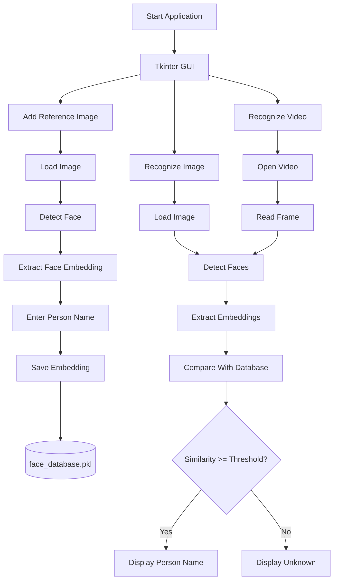

# 🧠 AI Face Recognition Desktop Application

<p align="center">
  <b>Local Face Detection & Recognition with Python, YOLO, InsightFace and OpenCV</b>
</p>

<p align="center">
  
  
  
  
  
  
</p>

<p align="center">
  <i>A local desktop application for face enrollment, image recognition, and video recognition.</i>
</p>

---

## 📌 Overview

This project is a **desktop face detection and recognition application** built with Python.

The application provides a graphical interface that allows users to:

- Add reference images for people.
- Associate a name with each reference face.
- Store multiple reference images for the same person.
- Recognize multiple faces in an image.
- Recognize faces in a video.
- Draw bounding boxes around detected faces.
- Display the recognized person's name.
- Display `Unknown` when a face cannot be matched.
- Store face embeddings locally in a database.
- Run face recognition locally without requiring a cloud API.

> **Important:** Adding a reference image does not retrain or fine-tune the neural network.  
> The application extracts a face embedding from the reference image and stores it in the local database.

---

# ✨ Features

| Feature | Description |
|---|---|
| 👤 Face Enrollment | Add a reference image and assign a name |
| ♾️ Multiple References | Store multiple images for the same person |
| 🗃️ Local Database | Store face embeddings in `face_database.pkl` |
| 🖼️ Image Recognition | Recognize faces in uploaded images |
| 🎥 Video Recognition | Recognize faces frame-by-frame in videos |
| 🔵 Face Detection | Draw blue bounding boxes around detected faces |
| 🏷️ Name Display | Show the recognized person's name |
| ❓ Unknown Detection | Display `Unknown` for unmatched faces |
| 🖥️ Desktop GUI | Built with Tkinter |
| 💻 Local Processing | No cloud recognition service is required |
| ⚡ uv | Modern Python dependency and environment management |

---

# 🧩 Technology Stack

```text
┌───────────────────────────────────────────────┐
│              Desktop GUI                     │
│                 Tkinter                      │
└──────────────────────┬────────────────────────┘
                       │
                       ▼
┌───────────────────────────────────────────────┐
│              Application Logic               │
│                   Python                     │
└───────────────┬───────────────┬───────────────┘
                │               │
                ▼               ▼
        ┌──────────────┐ ┌──────────────┐
        │    YOLO      │ │  InsightFace │
        │ Face Detect. │ │  Embeddings  │
        └──────┬───────┘ └──────┬───────┘
               │                │
               └────────┬───────┘
                        ▼
               ┌─────────────────┐
               │     OpenCV      │
               │ Image / Video   │
               └────────┬────────┘
                        │
                        ▼
               ┌─────────────────┐
               │ Face Database   │
               │ face_database   │
               │     .pkl        │
               └─────────────────┘
````

---

# 🧠 How Face Recognition Works

The application uses two main AI components:

### YOLO

YOLO is responsible for detecting face regions in images and video frames.

### InsightFace

InsightFace is used for face analysis and generating numerical **face embeddings**.

An embedding represents facial characteristics as a numerical vector.

The application compares the embedding of a detected face against the embeddings stored in the local database.

---

# 🔄 Recognition Workflow



---

# 👤 Face Enrollment

To add a person to the recognition database:

```text
Add Reference Image
        │
        ▼
Select Image
        │
        ▼
Detect Face
        │
        ▼
Extract Embedding
        │
        ▼
Enter Person Name
        │
        ▼
Save to Database
```

The process can be repeated as many times as required.

For example:

```text
John Doe
│
├── reference_01.jpg
├── reference_02.jpg
├── reference_03.jpg
├── reference_04.jpg
└── reference_05.jpg
```

Multiple images can belong to the same person.

This can help recognition under different:

* Lighting conditions
* Facial expressions
* Camera angles
* Head poses
* Image qualities

---

# 🖼️ Image Recognition

Click:

```text
Recognize Image
```

Then select an image.

The application will:

1. Detect all visible faces.
2. Extract face embeddings.
3. Compare them against the saved database.
4. Draw a blue bounding box around each detected face.
5. Display the person's name if a match is found.
6. Display `Unknown` if no sufficiently similar face is found.

Example:

```text
┌──────────────────────────────────────┐
│                                      │
│        ┌──────────────────┐          │
│        │                  │          │
│        │       FACE       │          │
│        │                  │          │
│        └──────────────────┘          │
│              John Doe                │
│                                      │
│                     ┌────────────┐   │
│                     │    FACE    │   │
│                     └────────────┘   │
│                        Unknown       │
│                                      │
└──────────────────────────────────────┘
```

---

# 🎥 Video Recognition

Click:

```text
Recognize Video
```

Select a supported video file.

The application processes the video frame-by-frame.

Supported video formats:

```text
.mp4
.avi
.mov
.mkv
.wmv
```

For every detected face:

```text
Detected Face
      │
      ▼
Extract Embedding
      │
      ▼
Compare With Database
      │
 ┌────┴────┐
 ▼         ▼
Match    No Match
 │         │
 ▼         ▼
Name     Unknown
```

The GUI also provides:

```text
Stop Video
```

to stop playback.

---

# 📁 Project Structure

The current project is organized approximately as follows:

```text
Projects Content/
│
├── .venv/
│
├── Face images/
│   └── Reference images
│
├── face_recognition_project/
│   │
│   ├── .venv/
│   ├── face_database.pkl
│   ├── main.py
│   │
│   └── models/
│       ├── yolov8m-face.pt
│       └── yolov10m-face.pt
│
├── runs/
│   └── Recognition output
│
├── src/
│
├── .gitignore
├── .python-version
├── pyproject.toml
├── README.md
└── uv.lock
```

---

# 📦 Recommended Project Structure

For a cleaner GitHub project, it is recommended to use a single virtual environment for the project:

```text
Projects Content/
│
├── .venv/
│
├── pyproject.toml
├── uv.lock
├── .python-version
│
├── face_recognition_project/
│   │
│   ├── main.py
│   ├── face_database.pkl
│   │
│   └── models/
│       ├── yolov8m-face.pt
│       └── yolov10m-face.pt
│
├── Face images/
├── runs/
└── src/
```

Having multiple `.venv` directories is generally unnecessary.

---

# 💻 Installation

## Requirements

Before running the project, install:

* Windows 10 or Windows 11
* Python 3.10+
* VS Code
* uv
* Git (recommended)

The current configuration is designed to run using CPU inference.

---

# 1️⃣ Install Python

Verify Python:

```powershell
python --version
```

Example:

```text
Python 3.11.x
```

If Python is not installed, download it from the official Python website:

[https://www.python.org/downloads/](https://www.python.org/downloads/)

---

# 2️⃣ Install uv

Verify whether uv is already installed:

```powershell
uv --version
```

If it is not installed, follow the official documentation:

[https://docs.astral.sh/uv/](https://docs.astral.sh/uv/)

After installation, restart VS Code.

---

# 3️⃣ Open the Project in VS Code

Open VS Code and select:

```text
File → Open Folder
```

Then open the project root.

Example:

```text
C:\Users\Neurocircuit\Documents\Projects Content
```

---

# 4️⃣ Open the VS Code Terminal

Open:

```text
Terminal → New Terminal
```

Navigate to the project directory:

```powershell
cd "C:\Users\Neurocircuit\Documents\Projects Content"
```

---

# 5️⃣ Synchronize the uv Environment

If the project already contains:

```text
pyproject.toml
uv.lock
```

run:

```powershell
uv sync
```

This is the recommended way to install the dependencies defined by the project.

---

# 6️⃣ Install Required Packages

If the dependencies are not already present in `pyproject.toml`, add them with:

```powershell
uv add opencv-python
uv add pillow
uv add numpy
uv add ultralytics
uv add insightface
uv add onnxruntime
```

Then run:

```powershell
uv lock
uv sync
```

---

# 📚 Main Dependencies

| Package         | Purpose                        |
| --------------- | ------------------------------ |
| `opencv-python` | Image and video processing     |
| `numpy`         | Numerical operations           |
| `Pillow`        | Image handling and GUI display |
| `ultralytics`   | YOLO inference                 |
| `insightface`   | Face analysis and embeddings   |
| `onnxruntime`   | CPU inference backend          |
| `tkinter`       | Desktop GUI                    |
| `pickle`        | Local database persistence     |

> `tkinter` is normally included with standard Python installations on Windows and is not installed through `uv`.

---

# 🐍 Python Virtual Environment

If using the root project's `.venv`:

```powershell
.venv\Scripts\Activate.ps1
```

The terminal should look similar to:

```text
(.venv) PS C:\Users\Neurocircuit\Documents\Projects Content>
```

Verify:

```powershell
python --version
```

And:

```powershell
where.exe python
```

---

# ▶️ Running the Application

Because `main.py` is inside:

```text
face_recognition_project/
```

navigate to it:

```powershell
cd "C:\Users\Neurocircuit\Documents\Projects Content\face_recognition_project"
```

Then run:

```powershell
python main.py
```

Or, using uv:

```powershell
uv run main.py
```

---

# ⚙️ VS Code Python Interpreter

If VS Code uses the wrong Python environment:

```text
Ctrl + Shift + P
```

Select:

```text
Python: Select Interpreter
```

Then select the appropriate `.venv` interpreter.

Verify from the terminal:

```powershell
where.exe python
```

---

# 🤖 YOLO Models

The project currently contains two YOLO models:

```text
models/
├── yolov8m-face.pt
└── yolov10m-face.pt
```

The active model is configured in:

```text
main.py
```

Example:

```python
YOLO_MODEL_PATH = "models/yolov8m-face.pt"
```

To switch to the other model:

```python
YOLO_MODEL_PATH = "models/yolov10m-face.pt"
```

Make sure the selected model actually exists.

---

# 🗃️ Face Database

The application stores enrolled face information in:

```text
face_database.pkl
```

Conceptually, each record contains:

```python
{
    "name": "Person Name",
    "embedding": "...",
    "image_path": "..."
}
```

The database is stored locally using Python's `pickle` module.

---

# 🎯 Recognition Threshold

The default configuration is:

```python
SIMILARITY_THRESHOLD = 0.35
```

The threshold controls how similar a detected face must be to a stored reference before it is considered a match.

### More conservative recognition

Increase the threshold:

```python
SIMILARITY_THRESHOLD = 0.40
```

### More permissive recognition

Decrease the threshold:

```python
SIMILARITY_THRESHOLD = 0.30
```

There is no universal optimal threshold.

The correct value depends on:

* Reference image quality
* Lighting
* Camera quality
* Face angle
* Dataset diversity
* Detection quality

---

# ⚙️ Main Configuration

Important settings in `main.py` include:

```python
YOLO_MODEL_PATH = "models/yolov8m-face.pt"

DATABASE_PATH = "face_database.pkl"

SIMILARITY_THRESHOLD = 0.35

YOLO_CONFIDENCE = 0.40
```

---

# 🖼️ Reference Image Recommendations

For better recognition results, reference images should ideally contain:

* A clearly visible face
* Good lighting
* Minimal blur
* Reasonable image resolution
* Limited occlusion
* A recognizable facial angle

It is recommended to use several images for important identities.

Example:

```text
Person A
├── Front view
├── Slight left angle
├── Slight right angle
├── Different lighting
└── Different expression
```

---

# 🔧 Troubleshooting

## `uv` is not recognized

Run:

```powershell
uv --version
```

If Windows cannot find uv, install it and restart VS Code.

---

## `ModuleNotFoundError`

Example:

```text
ModuleNotFoundError: No module named 'insightface'
```

Run:

```powershell
uv sync
```

If the package is missing from the project:

```powershell
uv add insightface
uv add onnxruntime
```

Then:

```powershell
uv run main.py
```

---

## YOLO Model Not Found

Verify:

```text
face_recognition_project/
│
├── main.py
│
└── models/
    ├── yolov8m-face.pt
    └── yolov10m-face.pt
```

And check:

```python
YOLO_MODEL_PATH = "models/yolov8m-face.pt"
```

Run the application from the directory containing `main.py`:

```powershell
cd "C:\Users\Neurocircuit\Documents\Projects Content\face_recognition_project"

uv run main.py
```

---

## Reference Image Causes an Error

If clicking:

```text
Add Reference Image
```

causes an error, verify:

1. The selected image is supported.
2. OpenCV can read the image.
3. The image contains a visible face.
4. InsightFace is installed correctly.
5. ONNX Runtime is installed.
6. The InsightFace model can initialize.
7. The application is being run from the correct directory.

Run:

```powershell
uv sync
```

Then:

```powershell
uv run main.py
```

If the problem persists, inspect the complete traceback shown in the VS Code terminal.

---

## No Face Detected

Try:

* Better lighting
* Higher-resolution image
* Larger face
* Less blur
* Less occlusion
* More frontal face angle

---

## Recognition Is Too Strict

Lower:

```python
SIMILARITY_THRESHOLD
```

For example:

```python
SIMILARITY_THRESHOLD = 0.30
```

---

## Recognition Produces False Matches

Increase:

```python
SIMILARITY_THRESHOLD
```

For example:

```python
SIMILARITY_THRESHOLD = 0.40
```

---

# 🔐 Privacy & Security

This application is designed around local processing.

Reference embeddings are stored locally in:

```text
face_database.pkl
```

However, face embeddings should be considered **biometric information**.

When using this project with real people:

* Obtain appropriate permission.
* Do not publish private reference images.
* Do not publish private biometric databases.
* Protect the local database.
* Follow applicable privacy and data-protection laws.
* Use the system only for legitimate and authorized purposes.

---

# 🚫 Recommended `.gitignore`

For a public GitHub repository, consider excluding:

```gitignore
# Python
__pycache__/
*.py[cod]
*.pyo

# Virtual environments
.venv/
venv/
env/

# Local biometric database
face_database.pkl

# Private reference images
Face images/*

# Generated recognition output
runs/*

# IDE
.vscode/
.idea/

# Operating system
.DS_Store
Thumbs.db
```

If you intentionally want to publish example images or generated output, modify these rules accordingly.

---

# 🔄 Development Workflow

Typical workflow:

```powershell
cd "C:\Users\Neurocircuit\Documents\Projects Content"

uv sync

cd face_recognition_project

uv run main.py
```

---

## Add a Dependency

```powershell
uv add package-name
```

Example:

```powershell
uv add requests
```

---

## Remove a Dependency

```powershell
uv remove package-name
```

---

## Synchronize Environment

```powershell
uv sync
```

---

## Update Lock File

```powershell
uv lock
```

---

# 🧪 Development Checklist

Before committing changes:

```text
☐ Application starts correctly
☐ Reference image enrollment works
☐ Multiple reference images work
☐ Image recognition works
☐ Video recognition works
☐ Unknown faces are detected
☐ YOLO model path is correct
☐ face_database.pkl is not accidentally committed
☐ Private images are not committed
☐ uv.lock is updated
☐ README is updated
```

---

# 📚 Official Documentation

### Python

[https://docs.python.org/3/](https://docs.python.org/3/)

### uv

[https://docs.astral.sh/uv/](https://docs.astral.sh/uv/)

### VS Code Python

[https://code.visualstudio.com/docs/python/python-tutorial](https://code.visualstudio.com/docs/python/python-tutorial)

### OpenCV

[https://docs.opencv.org/](https://docs.opencv.org/)

### Ultralytics

[https://docs.ultralytics.com/](https://docs.ultralytics.com/)

### InsightFace

[https://github.com/deepinsight/insightface](https://github.com/deepinsight/insightface)

### ONNX Runtime

[https://onnxruntime.ai/](https://onnxruntime.ai/)

### Tkinter

[https://docs.python.org/3/library/tkinter.html](https://docs.python.org/3/library/tkinter.html)

### Pillow

[https://pillow.readthedocs.io/](https://pillow.readthedocs.io/)

---

# 🗺️ Roadmap

Future improvements may include:

* [ ] Real-time webcam recognition
* [ ] GPU acceleration
* [ ] Better video face tracking
* [ ] Recognition confidence display
* [ ] Individual reference-image deletion
* [ ] Person name editing
* [ ] Search and filtering of enrolled people
* [ ] Database import/export
* [ ] SQLite database support
* [ ] Configurable threshold from the GUI
* [ ] Recognition history
* [ ] FPS and performance monitoring
* [ ] Improved video controls
* [ ] Face tracking
* [ ] Reduced repeated embedding calculations
* [ ] Windows executable packaging
* [ ] Automatic model validation
* [ ] Improved project architecture
* [ ] Automated tests

---

# 🧱 Future Architecture

A future version could separate the application into dedicated modules:

```text
face_recognition_project/
│
├── main.py
│
├── models/
│   ├── yolov8m-face.pt
│   └── yolov10m-face.pt
│
├── src/
│   ├── detector.py
│   ├── recognizer.py
│   ├── database.py
│   ├── video.py
│   ├── gui.py
│   └── utils.py
│
├── tests/
│   ├── test_database.py
│   ├── test_recognition.py
│   └── test_detection.py
│
├── face_database.pkl
├── pyproject.toml
├── uv.lock
└── README.md
```

This would make the project easier to maintain, test, and extend.

---

# 📄 License

Choose a license before publishing the project.

For example:

```text
MIT License
```

If using MIT, add a `LICENSE` file containing the official MIT License text.

---

# 👨‍💻 Project Status

This project is a local desktop computer-vision application focused on:

* Face detection
* Face embeddings
* Similarity-based face recognition
* YOLO inference
* OpenCV image processing
* OpenCV video processing
* Tkinter GUI development
* Local biometric-data storage
* Python dependency management with uv

---

# ⭐ Support

If you find this project useful:

* ⭐ Star the repository
* 🐛 Open an issue for bugs
* 💡 Open an issue for feature requests
* 🔧 Submit a pull request

---

<p align="center">
  <b>Built with Python • OpenCV • InsightFace • YOLO • Tkinter • uv</b>
</p>

<p align="center">
  Made for local computer-vision experimentation and development.
</p>
```
